# 🧠 GraphRAG: Knowledge Graph-Enhanced Retrieval-Augmented Generation

> **A production-grade implementation of Schema-Driven GraphRAG using LlamaIndex, Neo4j, and OpenAI**


This project demonstrates how to build a **GraphRAG** (Graph-based Retrieval-Augmented Generation) system that moves beyond naive vector similarity search. By leveraging knowledge graphs, we enable **multi-hop reasoning**, **structured domain modeling**, and **explainable AI responses**.

---

## 📐 Architecture

The system follows a three-phase pipeline: **Ingestion → Storage → Query**.

```mermaid
flowchart LR
    subgraph Ingestion ["📥 Ingestion Phase"]
        A[("📄 Documents<br/>(data/)")]
        B["🔬 Schema Extractor<br/>(LlamaIndex)"]
    end

    subgraph Storage ["💾 Storage Layer"]
        C[("🕸️ Neo4j<br/>PropertyGraph")]
    end

    subgraph Query ["🔍 Query Phase"]
        D["🧠 Query Engine<br/>(Tree Summarize)"]
        E["💬 Streamlit UI<br/>(Chat + Explorer)"]
    end

    A -->|"Load & Normalize"| B
    B -->|"Schema-Validated<br/>Triplets"| C
    C -->|"Graph Traversal"| D
    D -->|"Context + Response"| E
    E -->|"User Query"| D

    style A fill:#f9f9f9,stroke:#333
    style C fill:#d4edda,stroke:#155724
    style E fill:#cce5ff,stroke:#004085
```



### Data Flow

1. **Ingestion**: Documents are loaded, normalized (Title Case), and processed by `SchemaLLMPathExtractor`
2. **Schema Enforcement**: Only triplets conforming to the predefined ontology are persisted
3. **Storage**: Neo4j stores the property graph with typed nodes and relationships
4. **Querying**: The Query Engine traverses the graph using `TreeSummarize` for context retrieval
5. **Interface**: Streamlit provides a chat UI and interactive Pyvis graph visualization

---

## 🎯 Design Decisions

### Why GraphRAG over Vector-Only RAG?

| Aspect | Vector RAG | GraphRAG |
|--------|------------|----------|
| **Retrieval** | Semantic similarity (cosine distance) | Graph traversal + relationship-aware |
| **Reasoning** | Single-hop ("find similar chunks") | Multi-hop ("A relates to B, B affects C") |
| **Explainability** | Black-box embeddings | Traceable entity paths |
| **Complex Queries** | Struggles with "why" and "how" | Excels at relational reasoning |

**Example Query**: *"What materials are used by technologies that affect climate change?"*

- **Vector RAG**: Returns chunks mentioning "materials", "technologies", or "climate change" independently
- **GraphRAG**: Traverses `MATERIAL --USES--> TECHNOLOGY --AFFECTS--> CONCEPT:ClimateChange` to find precise relationships

> [!NOTE]
> GraphRAG shines when your data has **inherent structure**—domain entities with meaningful relationships. For unstructured Q&A on homogeneous documents, vector RAG may suffice.

---

### Why Neo4j over In-Memory Graphs (NetworkX)?

| Consideration | NetworkX | Neo4j |
|---------------|----------|-------|
| **Persistence** | RAM-only, lost on restart | Disk-backed, survives restarts |
| **Scalability** | ~100K nodes before slowdown | Millions of nodes |
| **Query Language** | Python iteration | Cypher (optimized traversals) |
| **Visualization** | Requires export | Built-in browser at `:7474` |
| **Production Readiness** | Prototyping only | Enterprise-grade |

**The Trade-off**: Neo4j adds infrastructure complexity (Docker container, credentials). For this demo, the benefits outweigh the cost:

1. **Persistence**: The graph survives between sessions—no re-ingestion on restart
2. **Debugging**: Cypher queries let us validate extraction quality directly
3. **Portfolio Value**: Demonstrates real-world database integration, not just scripts

---

### Schema Strategy: From Open Extraction to Defined Ontology

> [!IMPORTANT]
> This is the most critical engineering decision in the project.

#### The Problem with Open Extraction

LlamaIndex's default `KnowledgeGraphIndex` allows the LLM to extract **any** entity and relationship types. In practice, this produces:

```
# Actual output from open extraction:
(Solar Panel) --[is_a]--> (Device)
(solar panel) --[uses]--> (sunlight)
(SOLAR PANEL) --[generates]--> (electricity)
(photovoltaic cell) --[is_component_of]--> (Solar Panel)
```

**Issues**:
- **Case fragmentation**: "Solar Panel", "solar panel", "SOLAR PANEL" as separate nodes
- **Inconsistent relationships**: "is_a", "uses", "generates" with no schema
- **Synonyms as duplicates**: "photovoltaic cell" vs "PV cell" vs "solar cell"

#### Our Solution: Schema-Driven Extraction

We enforce a **fixed ontology** using `SchemaLLMPathExtractor`:

```python
# Allowed Entity Types
ENTITY_TYPES = Literal[
    "TECHNOLOGY", "CONCEPT", "LOCATION", 
    "METRIC", "ORGANIZATION", "MATERIAL"
]

# Allowed Relationship Types  
RELATION_TYPES = Literal[
    "USES", "PRODUCES", "LOCATED_IN",
    "AFFECTS", "HAS_METRIC", "DEVELOPED_BY"
]

# Validation Matrix: Which entity can have which outgoing relationships
VALIDATION_SCHEMA = {
    "TECHNOLOGY": ["USES", "PRODUCES", "LOCATED_IN", "HAS_METRIC", "DEVELOPED_BY"],
    "CONCEPT": ["AFFECTS", "USES", "PRODUCES"],
    # ...
}
```

**With `strict=True`**, the extractor rejects any triplet that doesn't conform to this schema. Combined with **Title Case normalization** during preprocessing, we get:

```
(Solar Panel:TECHNOLOGY) --[USES]--> (Silicon:MATERIAL)
(Solar Panel:TECHNOLOGY) --[PRODUCES]--> (Electricity:CONCEPT)
(Solar Panel:TECHNOLOGY) --[AFFECTS]--> (Climate Change:CONCEPT)
```

**Result**: Clean, queryable, predictable graph structure.

---

## 📝 Self-Correction & Lessons Learned

Building this project involved several iterations. Here's what we learned:

### 1. The "Spaghetti Graph" Problem

**Initial State**: Open extraction produced 200+ relationship types for a single document. The graph was dense but meaningless—every node connected to every other node with arbitrary edges.

**Solution**: Implemented `SchemaLLMPathExtractor` with `strict=True` mode. Reduced relationship types from 200+ to exactly 6 controlled types.

### 2. Entity Duplication

**Initial State**: "solar energy", "Solar Energy", "SOLAR ENERGY" created three separate nodes that should have been one.

**Solution**: Added a `normalize_text()` preprocessing step that converts all document text to Title Case before extraction. This reduced node count by ~40% while preserving semantic meaning.

### 3. Blocking I/O in the UI

**Initial State**: Graph visualization wrote temporary HTML files to disk, causing race conditions and filesystem pollution.

**Solution**: Refactored `visualizer.py` to generate Pyvis HTML as an in-memory string (`BytesIO`-style), eliminating disk I/O entirely.

### 4. Unhandled External Service Failures

**Initial State**: Neo4j or OpenAI timeouts crashed the app with raw exceptions.

**Solution**: Implemented async error handling in `query_engine.py` with specific catches for `ServiceUnavailable` and `RateLimitError`, returning user-friendly messages instead of stack traces.

> [!TIP]
> **For recruiters**: These iterations demonstrate debugging skills and the ability to recognize architectural problems before they become technical debt.

---

## 🚀 Quick Start

### Prerequisites

- **Docker & Docker Compose** (required)
- **OpenAI API Key** (GPT-4o-mini or better recommended)

### 1. Clone & Configure

```bash
git clone https://github.com/yourusername/simple-graphrag-demo.git
cd simple-graphrag-demo

# Set up environment variables
cp .env.example .env
```

Edit `.env` and add your OpenAI API key:

```env
OPENAI_API_KEY=sk-your-key-here
NEO4J_USERNAME=neo4j
NEO4J_PASSWORD=password
```

### 2. Launch the Stack

```bash
docker compose up
```

This single command:
1. ✅ Starts Neo4j and waits for it to be healthy
2. ✅ Builds the Streamlit application container
3. ✅ Connects all services via Docker networking

**First Launch**: Neo4j initialization takes ~30 seconds. Wait for the health check to pass.

### 3. Ingest Data

In a separate terminal, run the schema-driven ingestion:

```bash
docker compose exec app python -m src.ingestion
```

**Expected Output**:
```
============================================================
GraphRAG Schema-Driven Ingestion Pipeline
============================================================

Ontology:
  Entity Types: TECHNOLOGY, CONCEPT, LOCATION, METRIC, ORGANIZATION, MATERIAL
  Relation Types: USES, PRODUCES, LOCATED_IN, AFFECTS, HAS_METRIC, DEVELOPED_BY
------------------------------------------------------------
Loading documents from data...
Loaded 1 document(s)
Normalizing document text for entity consistency...
Building PropertyGraphIndex (this may take a while)...

✅ Ingestion complete! Schema-enforced knowledge graph is ready.
```

### 4. Access the Application

| Service | URL | Purpose |
|---------|-----|---------|
| **Streamlit App** | http://localhost:8501 | Chat UI + Graph Explorer |
| **Neo4j Browser** | http://localhost:7474 | Direct Cypher queries |

### Useful Commands

```bash
# Run in background
docker compose up -d

# View logs
docker compose logs -f app

# Stop all services
docker compose down

# Full reset (removes graph data)
docker compose down -v
```

---

## 📁 Project Structure

```
simple-graphrag-demo/
├── src/
│   ├── app.py              # Streamlit UI with chat and graph explorer
│   ├── database.py         # Centralized Neo4j connection factory
│   ├── ingestion.py        # Schema-driven extraction pipeline
│   ├── query_engine.py     # LlamaIndex query engine with error handling
│   └── visualizer.py       # In-memory Pyvis graph rendering
├── data/
│   └── renewable_energy.txt  # Sample domain documents
├── docker-compose.yml        # Full stack orchestration
├── Dockerfile                # Multi-stage app container
├── pyproject.toml            # Dependencies (uv/pip compatible)
└── .env.example              # Environment template
```

---

## 🔧 Customization

### Adding Your Own Data

1. Place `.txt` files in `data/`
2. Re-run ingestion: `docker compose exec app python -m src.ingestion`
3. Refresh the Streamlit app

### Adjusting the Ontology

Edit `ENTITY_TYPES`, `RELATION_TYPES`, and `VALIDATION_SCHEMA` in `src/ingestion.py` to match your domain.

### Graph Density

Modify `max_triplets_per_chunk` in `src/ingestion.py`:
- **Lower (1-3)**: Sparse, focused relationships
- **Higher (8-10)**: Dense, comprehensive coverage

---

## 📚 References

- [LlamaIndex PropertyGraphIndex](https://docs.llamaindex.ai/en/stable/module_guides/indexing/lpg_index_guide/) — Schema extraction documentation
- [Neo4j Graph Database Concepts](https://neo4j.com/docs/getting-started/) — Understanding property graphs
- [Microsoft GraphRAG Research](https://www.microsoft.com/en-us/research/blog/graphrag-unlocking-llm-discovery-on-narrative-private-data/) — Original GraphRAG paper

---

## 📄 License

MIT License — Use freely for learning, portfolios, and production.

---

<p align="center">
  Built with LlamaIndex · Neo4j · Streamlit · OpenAI
</p>
